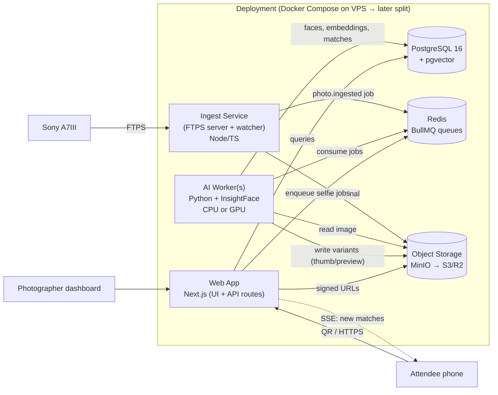
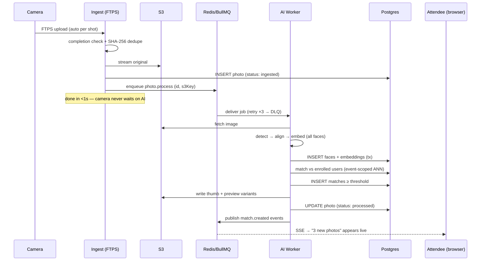

# 02 — System Architecture

> Status: Draft for review. Every decision here has a "why" — challenge any of them.

## 1. Bird's-eye view



Four runtime services + three stateful backends. Everything speaks through **Postgres, Redis, and S3** — no service-to-service HTTP calls, which keeps services independently deployable and crash-tolerant.

## 2. Service responsibilities

### 2.1 Web App — Next.js 15 (App Router), TypeScript, Tailwind
Owns: attendee flow (QR → selfie → gallery), photographer dashboard, organizer admin, auth, all CRUD APIs, signed-URL issuance, SSE stream for live gallery updates.

**Why Next.js API routes and not NestJS?** The API surface is CRUD + auth + signed URLs — request/response work with no long-lived compute (all heavy lifting lives in the Python worker). A separate NestJS service would duplicate auth middleware, session handling, deployment, and type-sharing for zero architectural gain at this stage. One codebase for UI + API also means one deploy and end-to-end types. **Escape hatch:** all business logic lives in `packages/core` (framework-free TypeScript modules — services, repositories), so if the API ever needs to move out of Next.js, routes are thin adapters and the move is mechanical, not a rewrite.

### 2.2 Ingest Service — Node/TS, small and dumb
Embedded FTPS server (or a hardened vsftpd sidecar writing to a watched volume — decided in implementation by testing against the actual A7III). Responsibilities, in order: accept upload → detect completion (size-stable / rename) → compute SHA-256 → dedupe → stream to S3 → insert `photos` row (status `ingested`) → enqueue `photo.process`. Nothing else. If Redis or the workers are down, photos still land in S3 + DB, and a reconciler enqueues them later — **ingestion never depends on processing**.

**Why a separate service, not part of Next.js?** FTP is a long-lived stateful socket protocol; Next.js is a request/response runtime. Also security isolation (threat T4 in doc 06): the FTP surface runs with credentials scoped per event and no access to anything but its S3 prefix and one queue.

### 2.3 AI Worker — Python, InsightFace, ONNX Runtime
Consumes `photo.process` and `selfie.enroll` jobs. Detect faces → align → embed → write to Postgres → run both match directions → emit `match.created` (which the web app fans out over SSE). Stateless; scale by adding replicas; same image runs CPU or GPU (ONNX Runtime execution provider flag). Full design in doc 03.

**Why Python?** InsightFace, ONNX tooling, and every serious face-recognition ecosystem is Python-native. JS ports (e.g. human, face-api.js) are 5–10 points worse on hard benchmarks and CPU-only. Fighting this means fighting the entire ML ecosystem forever.

**Python worker + BullMQ?** BullMQ is Node-only, so the worker consumes jobs via a thin protocol: BullMQ jobs are the source of truth, and the Python side uses `bullmq` (the official Python port, mature since 2023) — same Redis structures, same dashboard, retries, and DLQ semantics. One queue system, two languages.

### 2.4 Stateful backends
- **PostgreSQL 16 + pgvector** — single source of truth: relational data *and* embeddings (justified in 01 §2.3 and 03 §4). Prisma as ORM; raw SQL for vector queries via Prisma's typed raw layer.
- **Redis + BullMQ** — queues only. No cache duty in v1 (Postgres is fast enough; premature caching is a bug farm).
- **S3-compatible object storage** — MinIO in Docker for dev/VPS, migrate to Cloudflare R2 or S3 by changing env vars. Key layout: `orgs/{orgId}/events/{eventId}/originals/{photoId}.jpg` + `variants/{photoId}/{thumb|preview}.webp`. Bucket is fully private; every read goes through short-lived signed URLs.

## 3. Monorepo layout

```
sony_recognizer/
├── apps/
│   ├── web/                 # Next.js — UI + API routes (thin adapters)
│   ├── ingest/              # FTPS ingest service (Node/TS)
│   └── worker/              # Python AI worker (own pyproject, own Docker image)
├── packages/
│   ├── core/                # Domain logic, services, repositories (framework-free TS)
│   ├── db/                  # Prisma schema, migrations, generated client
│   ├── queue/               # Queue names, job payload schemas (zod) — shared contract
│   └── config/              # env parsing (zod), shared tsconfig/eslint
├── docs/
│   ├── design/              # these documents
│   └── adr/                 # Architecture Decision Records (one file per big call)
├── docker/                  # compose files: dev, prod
├── .github/                 # CI, issue templates, CONTRIBUTING
└── turbo.json               # Turborepo build orchestration
```

Job payload schemas in `packages/queue` are the **contract between TS and Python** — defined once in zod, exported as JSON Schema, validated on the Python side with pydantic. Contract drift fails CI, not production.

## 4. The ingest → gallery pipeline (the product's spine)



Failure behavior: any worker crash mid-job → BullMQ retry with backoff (job is idempotent: faces upserted by `(photoId, boundingBox-hash)`); 3 failures → dead-letter queue + dashboard alert; photo stays visible to the photographer as "processing failed", never lost.

## 5. Key architecture decisions (ADR summary)

| # | Decision | Choice | Rejected | Why (short) |
|---|---|---|---|---|
| ADR-1 | Backend shape | Next.js API + Python worker + ingest svc | NestJS monolith API | AI must be Python anyway; NestJS adds a 3rd deploy with no owned problem; core logic framework-free for portability |
| ADR-2 | Face stack | InsightFace (SCRFD + ArcFace-family, ONNX) | FaceNet, DeepFace, dlib, cloud APIs | Accuracy/speed/licensing — full comparison in 03 |
| ADR-3 | Vector search | pgvector + HNSW, event-scoped | Qdrant/Milvus/Weaviate | Searches always event-scoped (≤~250k vectors); transactional consistency with metadata; one less service. Revisit at 100M+ global vectors |
| ADR-4 | Queue | Redis + BullMQ (Node + Python clients) | RabbitMQ, Kafka, pg-boss | Retries/DLQ/dashboard out of the box; Redis already present; Kafka is absurd overkill at this stage. pg-boss was the runner-up (fewer moving parts) but BullMQ's Python client + UI won |
| ADR-5 | Auth | Better Auth | Auth.js | First-class anonymous sessions → account upgrade (core to attendee funnel, 01 §2.1), organization plugin for multi-tenancy, saner API. Auth.js fine but weaker on both counts |
| ADR-6 | Storage | S3 API from day one (MinIO dev) | Local FS first, S3 later | "Later" migrations of 150 GB/event never happen cleanly; signed-URL security model needs S3 semantics from the start |
| ADR-7 | Multi-tenancy | Single DB, `org_id` on every tenant row, enforced in repository layer (+ Postgres RLS as defense-in-depth later) | DB-per-tenant | Thousands of small tenants; ops simplicity; RLS gives hard isolation without infra multiplication |
| ADR-8 | Realtime | SSE | WebSockets | One-directional (server→client) is all we need; SSE survives proxies/CDNs, auto-reconnects, no sticky sessions |
| ADR-9 | Deploy | Docker Compose on one VPS → split worker to GPU box when metrics demand | Kubernetes | Compose is one file, debuggable, sufficient below ~10 concurrent events. The *architecture* (stateless services, queue-decoupled) is what makes later scaling possible — not the orchestrator |

Each of these becomes a proper ADR file in `docs/adr/` when we scaffold.

## 6. Scaling path (design now, build when needed)

| Stage | Trigger | Change |
|---|---|---|
| 0 (MVP) | — | 1 VPS, Compose: all services, 2 CPU worker replicas |
| 1 | Event-day p95 latency > 90s | Move worker to GPU box (Hetzner GPU / RunPod), same image, `EP=cuda` |
| 2 | Multiple concurrent large events | Worker autoscaling on queue depth; read replica for gallery queries |
| 3 | Storage egress cost | Variants behind CDN (R2 makes this free); originals stay signed-URL-only |
| 4 | 100M+ embeddings or cross-event features | Extract vector search to Qdrant; embeddings table becomes the sync source |

Nothing in stages 1–4 changes application code structure — that's the test the architecture must pass.
