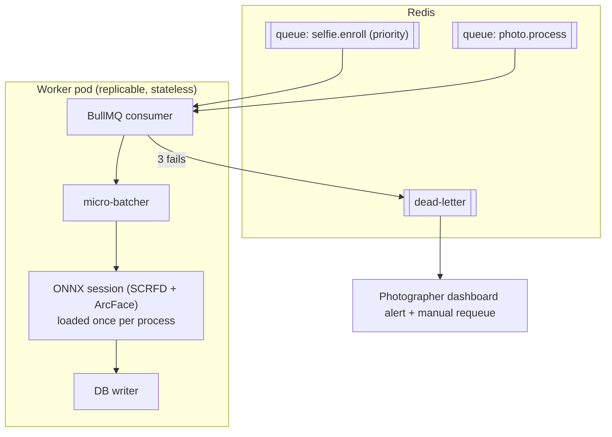

# 03 — AI Pipeline: Face Recognition, Vector Search & Worker Architecture

> Status: Draft for review

## 1. Model selection

### 1.1 The comparison you asked for

First, a category correction: **ArcFace is a loss function, not a library** — InsightFace models are trained with it. **OpenCV is not a face-recognition system** — its bundled recognizers are toy-grade; it's only useful here as an image I/O library. So the real contest:

| Criterion | **InsightFace** (SCRFD + ArcFace/AdaFace models) | FaceNet (facenet-pytorch) | DeepFace (wrapper lib) | dlib / face_recognition |
|---|---|---|---|---|
| Accuracy (IJB-C, hard poses) | **SOTA-class** (used as baseline in academic comparisons) | 2015-era, clearly behind | Depends on backend; adds no accuracy itself | Weakest of the group |
| Detector quality (small/blurred/profile faces — critical for event crowds) | **SCRFD: excellent, fast** | Needs external (MTCNN — slow, dated) | RetinaFace via wrapper (fine, slower) | HOG/CNN: poor on crowds |
| Inference speed | **ONNX Runtime: ~2× faster than TF/PyTorch equivalents; CPU and CUDA same code** | PyTorch, moderate | Layered overhead per call | Slow CNN or inaccurate HOG |
| Embedding size | 512-d float | 512-d | varies | 128-d |
| Production maturity | Powers commercial systems; active | Research legacy | Great for prototyping, not throughput | Legacy |
| License | Code MIT; **stock model weights: non-commercial research only** ⚠️ | MIT | MIT (backends vary) | Boost/MIT |

**Choice: InsightFace pipeline — SCRFD detector + ArcFace-family recognition model, run via ONNX Runtime.** Best detector for crowded event photos, best embeddings, one runtime for CPU/GPU, Python-native.

### 1.2 The licensing trap (this matters for a commercial SaaS)
InsightFace's pretrained `buffalo_l` weights are licensed **non-commercial**. Options, in order of preference:
1. **Commercially-licensed equivalent weights** — e.g. models trained on cleared datasets (several ArcFace-architecture models exist with permissive licenses, incl. AdaFace and community retrains on licensed data). Same architecture, same pipeline code.
2. License directly from InsightFace (they sell commercial licenses).
3. Self-train later (expensive; not v1).

Decision needed before **public launch**, not before development — we build against the ONNX interface so weights are a swappable artifact (`MODEL_PATH` env). Flagged as a launch-gate item in 07.

### 1.3 Pipeline stages per photo

```
image → SCRFD detect (all faces, ≥ ~20px)
      → filter: detection confidence + face quality score (blur/pose/occlusion)
      → align (5-point landmarks → 112×112 crop)
      → embed (512-d, L2-normalized)
      → persist face + embedding
      → match (both directions, §3)
```

Quality scoring is not optional garnish: low-quality faces produce garbage embeddings that poison matching. Faces below quality floor are stored (for the photographer's face-count stats and potential reprocessing) but **excluded from matching**.

## 2. Enrollment (selfie) path

Selfie upload is synchronous-feeling but queue-backed (`selfie.enroll`, high-priority queue — enrollment jobs jump ahead of photo jobs since a human is actively waiting):

1. Fast validation in-request: exactly one face, quality above floor → instant feedback ("retake: too dark") before the user leaves the camera screen.
2. Worker computes embedding, stores as `face_identities` row.
3. Event-scoped ANN search → matches → gallery populated. Target: **< 5s selfie-to-gallery**.

A user's identity embedding improves over time: confirmed matches ("Is this you?" → yes) update a **centroid embedding** (mean of confirmed, re-normalized), which measurably improves recall at fixed precision.

## 3. Matching — both directions, one index

- **Selfie → photos** (user enrolls mid-event): 1 ANN query against event's face embeddings.
- **Photo → users** (photos keep arriving): for each new face, ANN query against the event's *enrolled identities* (hundreds–thousands of vectors — trivially fast).

Similarity: cosine (equivalent to L2 on normalized vectors).
Thresholds (initial, to be tuned on real event data):
- `match ≥ 0.55` → auto-link to gallery
- `0.42 – 0.55` → "Is this you?" confirmation strip
- `< 0.42` → no match

Every auto-match stores its score; thresholds are per-event-type tunable (sports ≠ studio lighting).

## 4. Vector search: pgvector, and why not a vector DB

Numbers first. Worst-case event: 50k photos × 5 faces = **250k vectors**. HNSW over 250k 512-d vectors: query in **< 10 ms**, index fits comfortably in RAM (~700 MB including graph overhead). A dedicated vector DB (Qdrant/Milvus/Weaviate) earns its operational cost when you need: billions of vectors, cross-collection global search, or search-service isolation. We need none of these — **every query is event-scoped** (and identity-scoped queries are smaller still).

What pgvector buys us that a separate DB cannot:
- **Transactional consistency**: face row + embedding + match written in one transaction. No sync pipeline, no "embedding exists but photo was deleted" states — which, given GDPR deletion cascades (06), is a correctness requirement, not a convenience.
- **Deletion is `DELETE`**: biometric-data erasure is a SQL statement with FK cascades, auditable in one system.
- One backup story, one failover story, one service fewer at 2 a.m.

Implementation notes:
- `halfvec(512)` (fp16) — halves storage/RAM, negligible recall loss.
- Partial HNSW indexes per active event are unnecessary complexity; a single HNSW index with an `event_id` filter (pgvector ≥ 0.8 supports filtered HNSW scans well) is the starting point. If filtered-scan recall degrades, fall back to per-event partial indexes — measured decision, noted for the benchmark milestone.
- Escape hatch (02 ADR-3): repository interface `FaceIndex` with `search(eventId, vector, k)` — Qdrant becomes an alternative implementation, not a rewrite.

## 5. Worker architecture



- **Concurrency model**: one ONNX session per process; process-level parallelism (N replicas), not thread-level — avoids GIL and session contention. Each worker prefetches up to `BATCH=8` photo jobs and runs detection batched (GPU loves this; on CPU batch=1–2).
- **Priorities**: `selfie.enroll` starves `photo.process`, never the reverse — a waiting human beats a background photo.
- **Idempotency**: job key = photoId; faces upserted on `(photo_id, bbox_hash)`; matches on `(face_id, identity_id)` unique. Retries are safe.
- **Retries**: exponential backoff (5s/30s/2m) → DLQ. DLQ items surface in dashboard; "reprocess" button requeues.
- **Reconciler** (cron in ingest service): any photo in `ingested` state > 5 min with no active job → re-enqueue. Covers Redis loss — Postgres photo status is the ground truth, Redis is disposable.
- **Backpressure**: queue depth is a first-class metric; autoscaling (stage 2) keys off it.

## 6. CPU vs GPU sizing (the "advise me" answer)

Measured ballparks for SCRFD-10G + ArcFace-R100 class models on ONNX Runtime, per ~24 MP photo with ~4 faces:

| Hardware | Throughput/worker | 3,000-photo event backlog | Cost order |
|---|---|---|---|
| 8-vCPU VPS slice (2 workers) | ~1.5–3 photos/s total | cleared in ~20–35 min *if dumped at once*; **real-time during shooting: fine** (bursts of 20 photos clear in ~10s) | ~€40/mo |
| 1× RTX 4000-class GPU | ~25–50 photos/s | trivial; 50k-photo mega-event in < 30 min | ~€200–350/mo or ~€0.5/hr rented |

**Recommendation: start CPU-only on the VPS.** A photographer shoots bursts, not continuous streams — average arrival rate at a busy event is a few photos per *minute* per camera, and CPU workers keep p95 well under the 90s target. The moment you book a multi-photographer or 10k+ photo event, **rent a GPU for the day** (RunPod/Vast: same Docker image, `ONNX_EP=cuda`, point it at the queue, ~€5–15/event). That's the correct economics until recurring volume justifies owning GPU capacity — and it's a zero-code-change decision because the worker was designed for it.

Also on the roadmap-not-now list: smaller/faster detector for a first pass with SCRFD-10G re-run on low-confidence photos, INT8 quantization (both are CPU throughput ~2× levers if needed).
