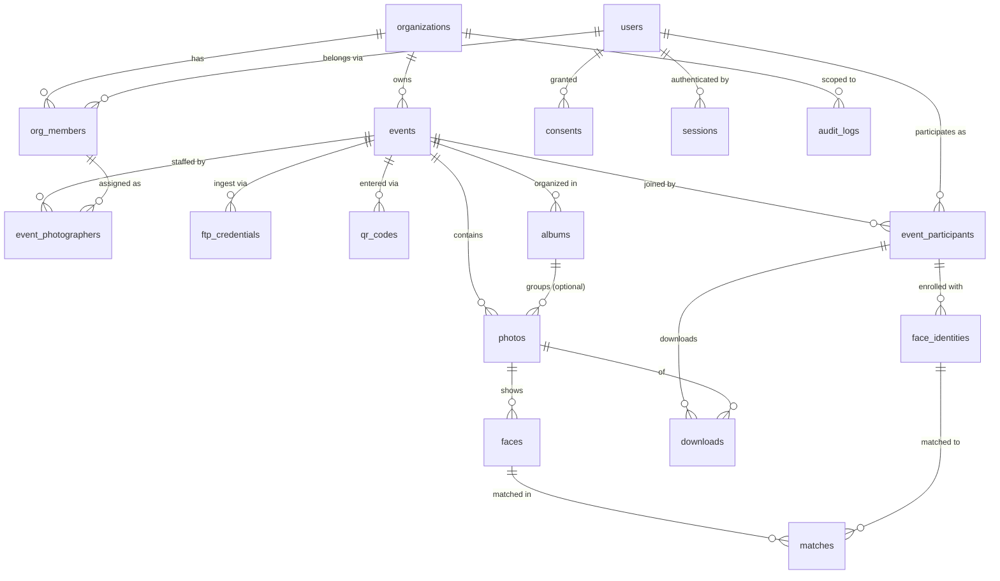

# 04 — Database Design

> PostgreSQL 16 + pgvector. Prisma manages schema/migrations; vector columns and HNSW indexes via Prisma `Unsupported("halfvec(512)")` + raw migration SQL.
> All PKs are **UUIDv7** (time-ordered → index-friendly, non-guessable → anti-enumeration, see 06).

## 1. Entity-relationship overview

## 2. Tables, with every relationship explained

### Identity & tenancy

**`users`** — one row per human account (attendee, photographer, org admin — same table, roles come from membership/participation). Better Auth owns `users`, `sessions`, `accounts` (OAuth), `verifications`; we extend with profile fields.
*Why one users table for all roles:* a photographer can attend someone else's event; role is contextual, not intrinsic.

**`organizations`** — the tenant. A freelance photographer gets an auto-created personal org (so multi-tenancy has no special cases). Fields: name, slug, plan, settings jsonb.

**`org_members`** — M:N `users`↔`organizations` with `role` (`owner | admin | photographer`). *Relationship:* a user can belong to many orgs (freelancer shooting for two agencies); an org has many members.

### Events

**`events`** — belongs to one organization (`org_id` FK). Fields: name, slug, venue, starts/ends at, `status` (`draft | live | closed | archived`), settings jsonb (auto_publish bool, match_threshold, retention_days, watermark…), `deleted_at`.
*Why settings jsonb:* per-event knobs (01 §2.4, 03 §3) vary by event type; promoting each to a column is churn without benefit.

**`event_photographers`** — M:N `events`↔`org_members`. *Why not events↔users directly:* shooting rights derive from org membership; when someone leaves the org, event access dies with the membership.

**`ftp_credentials`** — per **event** (not per photographer): generated username/password (hashed) the camera is configured with, S3 prefix scope, `expires_at` (auto-disable after event ends). One event may have several (one per camera body). *Why per-event:* blast-radius containment — leaked camera creds compromise one closed event only.

**`qr_codes`** — belongs to event. Fields: `token` (unguessable, the thing encoded in the QR), target (`event_page`), `revoked_at`, scan_count. Separate table (not a column on events) because: multiple posters/variants per event with separate scan analytics, and revocable independently (a QR leaked publicly can be rotated without changing the event URL).

### Photos & faces

**`photos`** — belongs to event; optional `album_id`; `uploaded_by` → event_photographers (nullable — FTP uploads attribute via credential). Fields: `content_hash` (sha256, **unique per event** — dedupe), s3_key, exif jsonb (captured_at, camera serial), width/height, `status` (`ingested | processing | processed | failed | quarantined`), `published` bool, `published_at`, `deleted_at`.
*Relationships:* event 1:N photos (the core partition axis — every hot query filters on event_id); album 1:N photos optional (albums are curation, not containment).

**`albums`** — belongs to event. Curated subsets ("Ceremony", "Finish line"). Photos reference at most one album in v1 (M:N join deferred until a real need appears — YAGNI).

**`faces`** — belongs to photo (CASCADE on delete: erasing a photo erases its biometric derivatives — GDPR by construction). Fields: bbox (x,y,w,h), `bbox_hash` (idempotency key with photo_id), detection_score, quality_score, landmarks jsonb, `embedding halfvec(512)`, `event_id` (**deliberately denormalized** from photo — the ANN query filters on it; joining photos inside a vector scan would wreck the index strategy).
*Why embedding lives on faces, not a separate table:* 1:1 always; a join buys nothing and costs the hot path.

**`face_identities`** — belongs to `event_participants`. The *enrolled* selfie embeddings: `embedding halfvec(512)`, `source` (`selfie | confirmed_centroid`), selfie_s3_key, `active` bool. Separate from `faces` because lifecycle differs completely: faces are derived from event photos and expire with retention; identities are user-consented enrollment data deleted with the account/participation.
*Why per-participation and not per-user:* consent and matching are event-scoped (06). Cross-event reuse of a selfie is an explicit user opt-in later, not a default.

### Participation & matching

**`event_participants`** — M:N `users`↔`events` with lifecycle fields: `joined_via` (qr token FK), `consent_id`, `anonymous_session_id` (pre-account phase, 01 §2.1), `status` (`active | withdrawn`). *This row is the authorization anchor:* no participant row → no gallery, period.

**`matches`** — the money table. `face_id` FK, `identity_id` FK (→ face_identities), denormalized `photo_id` + `participant_id` + `event_id` (gallery query = one index scan, zero joins on the hot path), `score`, `status` (`auto | pending_confirmation | confirmed | rejected | suppressed`), unique `(face_id, identity_id)`.
*Why status enum:* implements the two-threshold UX (01 §2.5) and suppression (privacy incidents, 06) without deleting evidence.

**`consents`** — belongs to user. `kind` (`biometric_processing | marketing`), `scope` (event_id or null), policy_version, granted_at, `withdrawn_at`. Append-only: withdrawal is a new state, not a row deletion — you must be able to *prove* consent existed at processing time (GDPR accountability).

### Delivery & accountability

**`downloads`** — participant_id, photo_id, variant, ip, user_agent, created_at. *Why log every download:* photographer analytics, billing (per-download pricing later), and abuse forensics. Also serves as the audit trail for original-file egress.

**`sessions`** — Better Auth managed; includes anonymous sessions (null user_id + device fingerprint) that upgrade in place when the account is created.

**`audit_logs`** — append-only: org_id, actor (user_id | system | worker), action, entity type/id, metadata jsonb, created_at. Every privacy-relevant mutation (publish/unpublish, consent change, deletion, suppression, threshold change, export) lands here. Partitioned by month; no FK to entities (must survive their deletion).

## 3. Deletion & retention semantics (GDPR by schema)

- User deletes account → cascade: participations → face_identities → matches; consents kept (legal proof) with user row pseudonymized.
- Photo deleted/unpublished → faces CASCADE → matches CASCADE. Galleries self-heal because they read through `matches`.
- Retention job (cron): events past `ends_at + retention_days` → embeddings nulled on `faces` (bbox stats kept for photographer analytics), unmatched faces' rows deleted, audit_log entry written.
- Non-user exclusion requests (01 §2.6): `exclusion_requests` table — selfie → embedding → matched faces get `matches.status = suppressed` + future matching blocklist for that event. Embedding deleted after processing.

## 4. Hot queries & index plan

| Query | Shape | Index |
|---|---|---|
| Attendee gallery | `matches WHERE participant_id = ? AND status IN (auto, confirmed) ORDER BY photo captured_at` | `(participant_id, status)` + denormalized photo_id |
| New-photo matching | ANN over enrolled identities in event | HNSW on `face_identities.embedding` + `event_id` filter |
| Selfie enrollment search | ANN over event faces | HNSW on `faces.embedding` + `event_id` filter (halfvec, cosine) |
| Photographer dashboard | `photos WHERE event_id = ? GROUP BY status` | `(event_id, status)` |
| Dedupe on ingest | `photos WHERE event_id = ? AND content_hash = ?` | unique `(event_id, content_hash)` |

Scale posture: `faces` and `matches` are the big tables (250k faces/event × events). List-partition by `event_id` **only when** row counts demand it (≈ 50M+); the schema requires no change because every query already carries event_id.

## 5. Prisma schema

The full `schema.prisma` is produced at scaffold time (milestone M0) from this document — this doc is the source of truth for review; the schema file is its mechanical translation.
